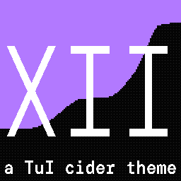
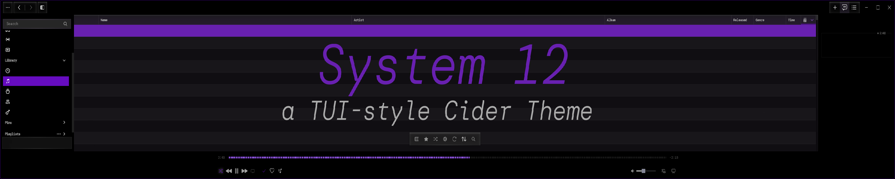
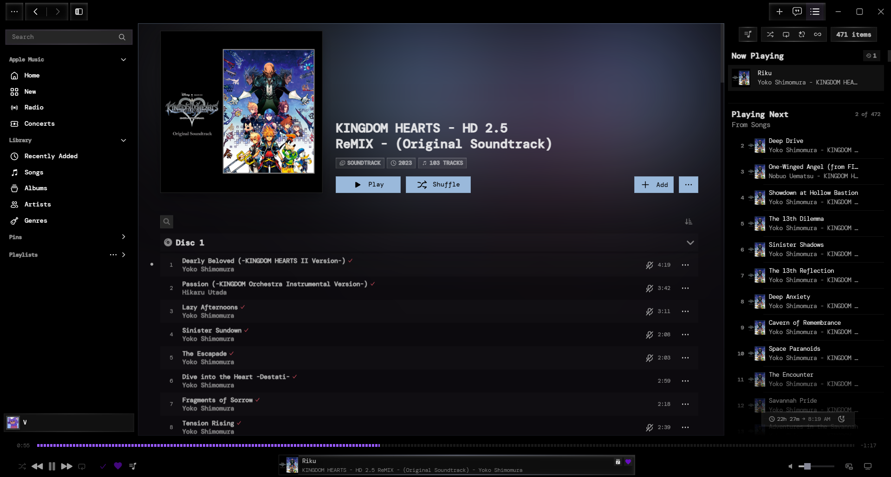

# system12

a tui-style theme for [Cider](https://cider.sh). monospace text, black panels, square corners, and an accent color that follows whatever you pick in Cider. named after and ported from [system24](https://github.com/refact0r/system24), the discord theme.

## Install
1- from [marketplace](https://marketplace.cider.sh/themes/106)  

2- manual install
  1. download this folder (`sys12`).
  2. put it in Cider's themes folder. on Windows that's usually `%appdata%\C2Windows\themes\`.
  3. restart Cider, open the theme settings and enable **system12**.

the folder must contain `theme.yml` and the `.css` files directly inside it, not one folder deeper.

> **renaming the folder?** disable the theme first, quit Cider, rename it, start Cider and enable it again. renaming it while it's enabled can leave Cider stuck on the old name.
## Preview

## Style sheets

the theme is split into parts. each one has its own checkbox in Cider's theme card, so you can switch off what you don't want.

| Style sheet | what it does |
|---|---|
| **Core** (keep on) | colors, the accent color that follows Cider, the black background, and the light palette for light mode. every other part uses these colors, so turning this off breaks the rest. |
| **font** | DM Mono everywhere, including lyrics (side panel and fullscreen), and a smaller name size in the artists list so names fit the wider font. |
| **Square style** | square corners everywhere and same-size top-bar buttons. keep these two together, because square corners alone make the top bar look odd. |
| **Controls** | hover and selected tints, the accent "cursor" bar on hovered rows and the selected sidebar item, text fields, scrollbars, block caret, and toggle switches with clear on/off states. |
| **Song list** | brighter, bolder song text, readable column headers, and white text on the selected row. |
| **Progress bar** | an accent-colored fill with a blocky, text-style look. |
| **Settings window** | a black settings window instead of an accent-colored tint. |

## Customizing

open the `.css` file for the part you want and edit the values near the top.

| what | file | setting |
|---|---|---|
| force one accent color instead of following Cider | `core.css` | uncomment the `--accent-base` override line |
| font, weight, letter spacing | `font.css` | `--font`, `--font-weight`, `--letter-spacing` |
| artists list name size | `font.css` | `--artist-name-size` |
| top-bar button size | `square-and-top-bar.css` | `--chrome-btn-size` |
| song text brightness and weight | `song-list.css` | `--list-text`, `--list-text-dim`, `--list-header`, `--list-weight`, `--list-title-weight` |
| progress bar block size | `progress-bar.css` | the `5px` and `7px` in the gradient |

to use a different font, change the name in `--font` and in the `@import` line at the top of `font.css`, and use the same name in the lyrics rule further down that file.

## Light mode

light mode switches on by itself when Cider is in light mode (Settings → Visual → Color Scheme). it uses a white background, dark text, and deeper accent shades so accent text and borders stay readable on white.

## Notes

- **the accent color** comes from Cider's `--keyColor` variable. plugins that recolor Cider, or adaptive colors, change it too, and the theme follows.
- **pale accent colors** are hard to read on a light background. that's the color, not the theme. use the override line in `core.css` if you want a fixed, deeper one.
- **bold titles** in the song list are browser-faked, because DM Mono only comes in light, normal and medium. set `--list-title-weight` to `500` if it looks smudged.
- **some Cider text is forced white** by Cider itself, for example in some pop-up menus and lists. the theme fixes the ones it knows about in light mode. if you find another, let the author know.
- **icons** use an icon font that breaks if the letter spacing isn't reset, so `font.css` resets it on icon elements. if you add global text rules, leave those alone.
- the theme uses newer CSS (`oklch()` relative colors, `color-mix()`, `:has()`), which needs a recent Cider build.

## Where this comes from

these themes all grew out of each other, each one inspired by the one before it:

1. **[spotify-tui](https://github.com/Rigellute/spotify-tui)** by [Rigellute](https://github.com/Rigellute), a Spotify client for the terminal written in Rust. this is where the terminal look started.
2. **[spicetify text theme](https://github.com/spicetify/spicetify-themes/tree/master/text)** by [darkthemer](https://github.com/darkthemer/), a spicetify theme that mimics the look of spotify-tui.
3. **[system24](https://github.com/refact0r/system24)** by [refact0r](https://github.com/refact0r), a tui-style discord theme inspired by the spicetify text theme.
4. **system12** (this theme), a port of system24's look to Cider, named as a nod to it. the colors, the font and the overall design come from system24, and the Cider styling itself is written from scratch.

thanks to everyone who made the ones before it. this theme is not affiliated with any of them.
